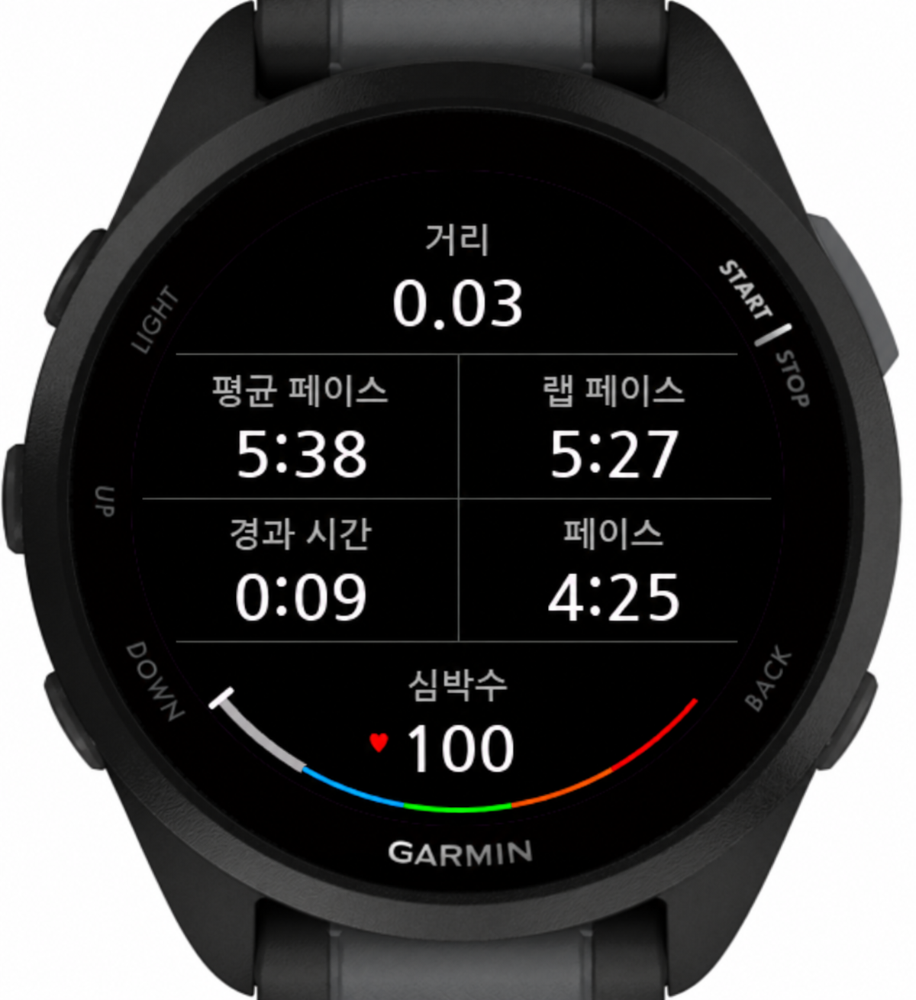

# Six Run

Forerunner 165와 Forerunner 165 Music을 위한 Connect IQ 러닝 데이터 필드입니다.
한 화면에서 러닝 중 필요한 여섯 가지 정보를 확인할 수 있습니다.

현재 버전: `0.1.0`



## 주요 기능

- 거리
- 평균 페이스
- 현재 랩 페이스
- 현재 페이스
- 경과 시간
- 현재 심박수
- 사용자 러닝 심박 존을 반영한 5단계 컬러 게이지
- 현재 심박수 위치를 보여주는 흰색 표시 막대
- 한국어 및 영어 인터페이스

모든 데이터는 Garmin 기본 러닝 활동에서 전달받아 표시합니다. Six Run 자체는 활동을 기록하거나 외부 서버로 데이터를 전송하지 않습니다.

## 화면 구성

Six Run은 하나의 Connect IQ 데이터 필드 안에서 여섯 개 값을 그립니다.

| 위치 | 왼쪽 | 오른쪽 |
| --- | --- | --- |
| 상단 | 거리 |  |
| 가운데 위 | 평균 페이스 | 랩 페이스 |
| 가운데 아래 | 경과 시간 | 현재 페이스 |
| 하단 | 심박수 및 심박 존 |  |

반드시 Garmin 활동 설정에서 **1칸 데이터 화면**에 배치해야 합니다. 작은 분할 영역에 배치하면 `1칸 화면을 사용하세요`라는 안내가 표시됩니다.

## 심박 존

앱은 Garmin 사용자 프로필에 설정된 러닝 심박 존을 사용합니다.

- Zone 1: 회색
- Zone 2: 파란색
- Zone 3: 초록색
- Zone 4: 주황색
- Zone 5: 빨간색

현재 존은 더 굵게 표시되며, 흰색 막대는 해당 존 안에서 현재 심박수가 위치한 비율을 나타냅니다. 심박 존을 읽기 위해 `UserProfile` 권한을 사용합니다.

## 데이터 기준

- 거리는 `Activity.Info.elapsedDistance`를 km로 변환하여 소수점 둘째 자리까지 표시합니다.
- 평균 페이스는 Garmin이 제공하는 `averageSpeed`를 분/km로 변환합니다.
- 현재 페이스는 Garmin이 제공하는 `currentSpeed`를 분/km로 변환합니다.
- 경과 시간은 일시정지 시간이 제외되는 `timerTime`을 사용합니다.
- 랩 페이스는 현재 랩에서 증가한 거리와 타이머 시간을 이용해 계산합니다.
- 타이머가 일시정지되면 거리, 페이스, 랩 페이스와 경과 시간은 마지막 값으로 유지됩니다. 심박수는 계속 갱신됩니다.

운동 도중 데이터 필드가 처음 생성되면 현재 랩의 시작 거리와 시간을 알 수 없습니다. 이 경우 다음 자동 또는 수동 랩이 시작될 때까지 랩 페이스가 표시되지 않을 수 있습니다.

## 지원 기기

- Garmin Forerunner 165 (`fr165`)
- Garmin Forerunner 165 Music (`fr165m`)

현재 레이아웃은 두 모델의 원형 디스플레이에 맞춰져 있습니다.

## 개발 환경

다음 도구가 필요합니다.

- Visual Studio Code
- Garmin Monkey C 확장
- Connect IQ SDK 및 SDK Manager
- Java
- Connect IQ 개발자 키

개발자 키는 저장소에 커밋하지 마세요. 이 프로젝트의 `.gitignore`는 `developer_key*`, `*.der`, `*.pem`을 제외하도록 설정되어 있습니다.

## 빌드

VS Code에서 Monkey C 소스 파일을 연 뒤 `Run Without Debugging`을 실행하거나, SDK의 `monkeyc`를 이용해 빌드할 수 있습니다.

Forerunner 165:

```sh
monkeyc -f monkey.jungle -d fr165 -o garminsix.prg -y /absolute/path/to/developer_key
```

Forerunner 165 Music:

```sh
monkeyc -f monkey.jungle -d fr165m -o garminsix.prg -y /absolute/path/to/developer_key
```

생성되는 `.prg` 파일과 빌드 중간 산출물은 Git에서 제외됩니다.

## 시뮬레이터에서 실행

1. Connect IQ Simulator를 실행합니다.
2. VS Code에서 `Run Without Debugging`을 선택합니다.
3. 대상 기기로 Forerunner 165 또는 Forerunner 165 Music을 선택합니다.
4. 러닝 활동과 센서 데이터를 설정해 화면을 확인합니다.

CLI를 사용하는 경우 다음과 같이 실행할 수 있습니다.

```sh
monkeydo garminsix.prg fr165
```

## 실기기에 직접 설치

1. 워치를 컴퓨터에 연결합니다.
2. 기기에 맞게 빌드한 `.prg` 파일을 워치의 `GARMIN/APPS` 폴더에 복사합니다.
3. 워치의 러닝 활동에서 데이터 화면 설정을 엽니다.
4. 1칸 레이아웃을 추가하고 `Connect IQ → Six Run`을 선택합니다.

macOS에서 MTP 방식의 워치가 Finder에 표시되지 않는 경우 별도의 MTP 파일 전송 도구가 필요할 수 있습니다.

## Connect IQ Store 배포

스토어에는 `.prg`가 아닌 `.iq` 패키지를 제출해야 합니다.

1. VS Code 명령 팔레트에서 `Monkey C: Export Project`를 실행합니다.
2. 지원 기기와 언어를 확인하고 `.iq` 파일을 생성합니다.
3. [Garmin Connect IQ 앱 제출 페이지](https://developer.garmin.com/connect-iq/submit-an-app/)에서 패키지, 설명과 스크린샷을 등록합니다.
4. 검토를 요청하고 승인 결과를 기다립니다.

## 라이선스

이 프로젝트는 [MIT License](LICENSE)로 배포됩니다.

## 참고 문서

- [Connect IQ SDK](https://developer.garmin.com/connect-iq/sdk/)
- [Activity.Info API](https://developer.garmin.com/connect-iq/api-docs/Toybox/Activity/Info.html)
- [WatchUi.DataField API](https://developer.garmin.com/connect-iq/api-docs/Toybox/WatchUi/DataField.html)
- [UserProfile API](https://developer.garmin.com/connect-iq/api-docs/Toybox/UserProfile.html)
